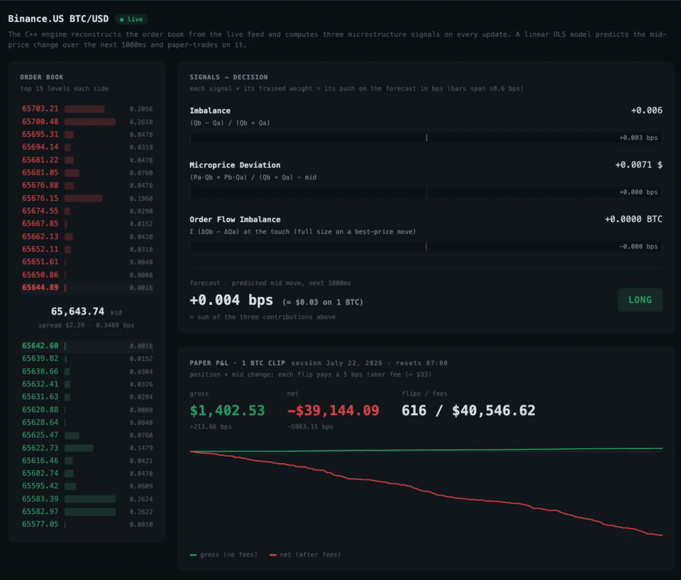
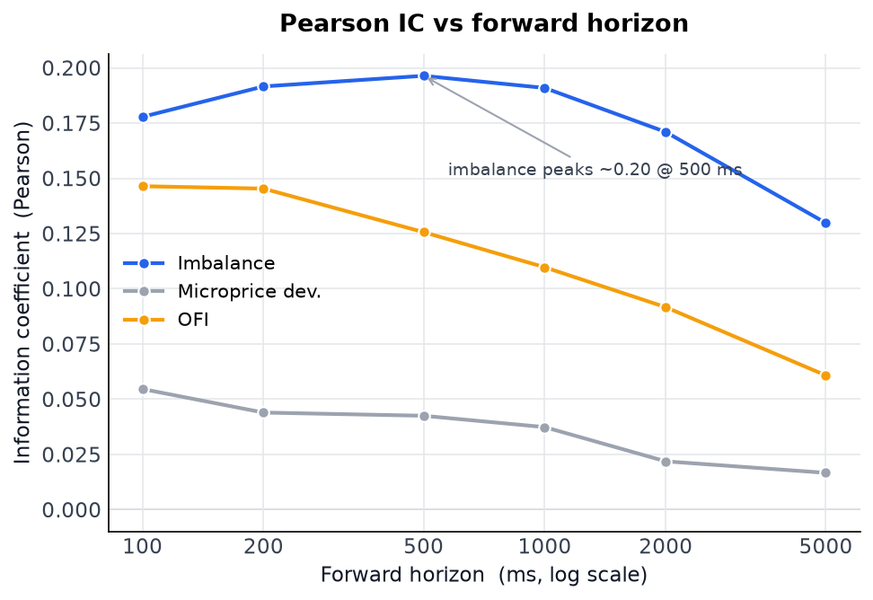
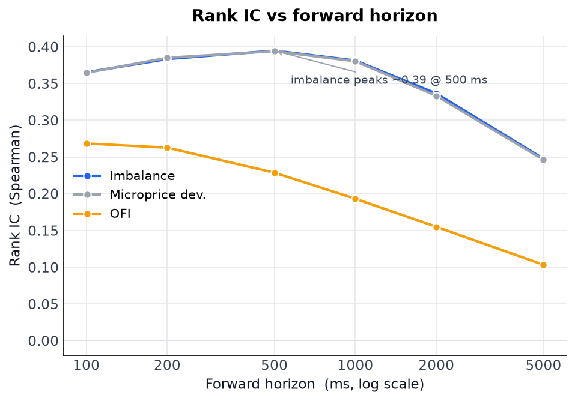
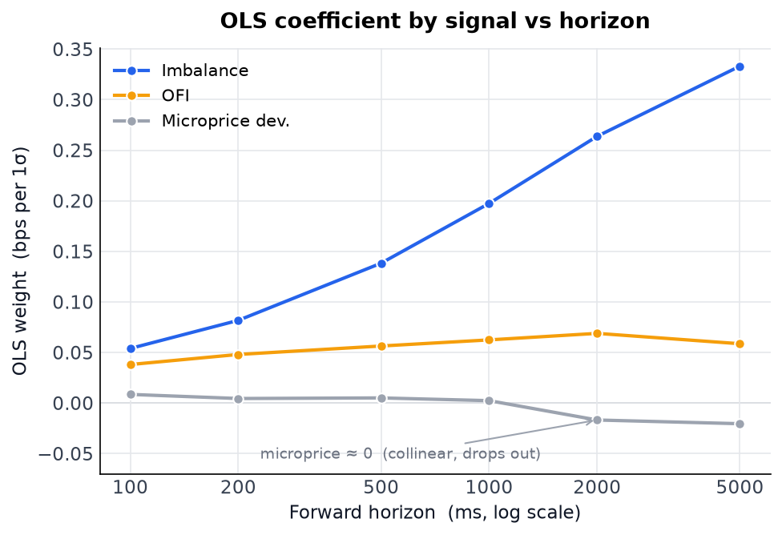
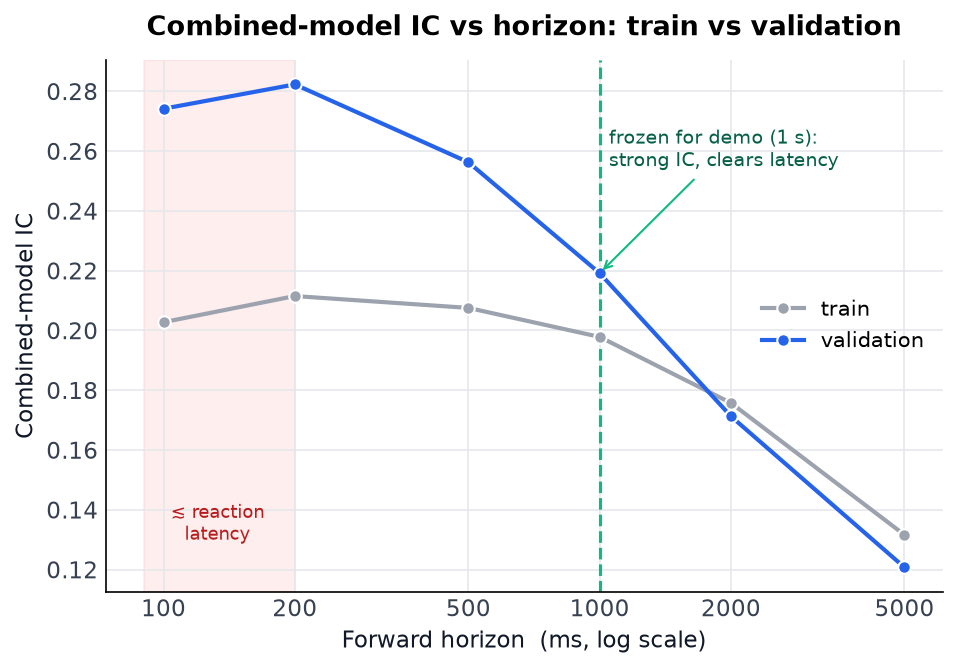
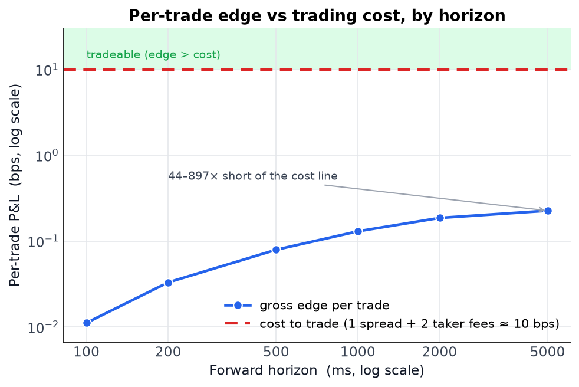

# Limit Order Book

A C++ engine reconstructs a limit order book from market data, computes microstructure
signals, and tests whether they predict short-term price moves. The engine is validated
on historical equities (Nasdaq ITCH and LOBSTER); the three signals are then combined in an
OLS model, trained and tested on Binance BTC futures, where it shows a small edge
(too small to be tradable with book fees). The demo below points the futures-trained model at live BTC spot.



*Live Binance.US BTC/USD spot → C++ book + 3 signals → the model's decision → a
paper P&L. The live P&L is illustrative; the rigorous result is under [Evaluation](#evaluation).*

## Architecture

The book exposes three operations: `add`, `cancel`, `execute`. Each feed translates its wire format into these calls.

```
  LOBSTER CSV ─┐
  ITCH binary ─┼─►  add / cancel / execute  ──►  OrderBook  ──►  Signals::update  ──►  CSV / live JSON
  crypto JSON ─┘   └────────────────────── hot path ──────────────────────┘             (streamed out)
```

The **hot path** (`parse → book → signals`, every event) works in preallocated memory.
Three layers:

| layer | language | job |
|---|---|---|
| engine + signals | C++ | book reconstruction and the 3 signals |
| analysis + model | Python (numpy) | IC study, OLS fit, taker-only P&L backtest, LOBSTER cross-check |
| dashboard | JavaScript | draw the ladder, signals, and P&L |

## Order book

A few nested structures keep price–time priority. Prices are integer ticks.

| structure | type | role |
|---|---|---|
| `Order` | `{ id, side, price, qty, prev, next }` | one resting order; `prev`/`next` make it a node in its price level's FIFO queue |
| `PriceLevel` | `{ total_qty, head, tail }` | holds all orders at one price as a FIFO: append at `tail`, fill from `head` |
| `bids_` / `asks_` | `vector<PriceLevel>` indexed by `price − base_tick` | O(1) access to any price level |
| `orders_` | `unordered_map<OrderId, Order>` | maps id → order for O(1) cancel/execute |
| `best_bid_idx_` / `best_ask_idx_` | `int` | tracks top-of-book |

The intrusive list makes cancel O(1).
The `PriceLevel` array lets us index any level in O(1) and contiguously, whereas
`std::map<Price, PriceLevel>` would make every add/cancel O(log n) and jump around
memory; the cost is preallocated memory for the price range.

| op | mechanics | cost |
|---|---|---|
| `add` | allocate the `Order` node in `orders_` → append to its level's FIFO tail → bump `total_qty` → update best idx if now best | O(1) |
| `cancel` | look up the `Order*` → unlink from its level → subtract qty → erase from `orders_` | O(1)\* |
| `execute` | reduce order `id` by qty → remove if fully filled | O(1)\* |
| `replace` | delete + add (how ITCH models it) | O(1)\* |

\* any removal that empties the best level (a cancel, a full-fill execute, or replace's
delete) scans inward for the next non-empty level, which becomes the new best. Worst case
that's the whole price array, but the best price usually moves only a tick or two.

**Latency** (synthetic single-symbol stream, 1M ops, Apple Silicon):

| op | ns/op | p99 | p99.9 | tail cause |
|---|---|---|---|---|
| `add` | ~34 | 42 ns | ~900 ns | cache miss when the order lands in memory not yet cached |
| `execute` | ~28 | 42 ns | ~200 ns | a partial fill is just a decrement |
| `cancel` | ~45 | ~170 ns | ~230 ns | inward scan to the next live level |

A single op is faster than the 41 ns timer tick, so p50 is unresolvable; we use `ns/op` (mean =
loop total ÷ N) instead.

## Feeds and validation

| feed | what | result |
|---|---|---|
| **LOBSTER** (AAPL 2012-06-21) | CSV, cross-checks correctness | 0 add errors, 99.9995% delta-correct over 392k events |
| **Nasdaq ITCH 5.0** (2019-01-30, AAPL) | 11 GB binary, full day from empty | 0 crossed books, ~12M msg/s |

LOBSTER ships a reconstructed book to check ours against, but the free sample starts
mid-day and only shows the top 10 levels, so our book can't match theirs exactly. Instead
we check that each event changes a price level by the same amount in both books, which
doesn't depend on the history we missed. ITCH is the full feed from the
open, so we rebuild from empty with nothing missing. There's no reference book to compare
against, so we check the book's own invariants: every cancel or execute must hit a live
order, and the book must never cross.

## Signals

Three signals, all from the top of book (best bid `Pb, Qb`; best ask `Pa, Qa`;
mid = `(Pb + Pa)/2`):

- **imbalance** `I = (Qb − Qa)/(Qb + Qa)`: queue pressure at the best bid/ask, normalized to
  [−1,+1]. More size resting on the bid than the ask (`I > 0`) leans the next move up.
- **microprice deviation** `micro − mid`, where `micro = (Pa·Qb + Pb·Qa)/(Qb + Qa)`: the
  size-weighted fair value, minus the mid. The crossed weights (ask price × bid size) pull
  fair value toward the side with less size. Note that when the spread is one tick this reduces to
  `(spread/2)·I`.
- **OFI** (order flow imbalance) `eb − ea`: net signed order flow since the last event, not
  a snapshot. When the bid ticks up, the full size at the new level counts as buying flow;
  same price counts only the size change; a pulled bid counts the lost size. The ask mirrors
  this.

## Evaluation

**Setup.** We evaluate on 45 days of Binance BTC futures, sampled to one row every 100 ms with the
best bid and ask. The prediction target is the change in mid price over the next `h` milliseconds.
We split the days chronologically into 30 for training, 5 for validation, and 10 for test, and
never shuffle them, so every prediction is made forward from past data; shuffling would place
near-identical neighbouring rows on both sides of the split. Signals are standardized using
training-set statistics only, and any prediction whose horizon extends past the end of a day is
discarded.

### Train

We begin with each signal on its own, measuring its information coefficient (IC): the correlation
between the signal at time `t` and the realized return over the next `h` ms. Imbalance is the
strongest predictor, and its IC is stable across a broad band of horizons, peaking around 500 ms to
1 s. OFI is faster, strongest at 100 to 200 ms before decaying, consistent with its reading as a
burst of order flow rather than a standing state.



Measured by rank rather than by raw values, the IC is higher: about 0.39 for imbalance against
0.20. The gap indicates that the signal orders future returns correctly but the relationship is not
linear, since the raw correlation is penalized by the heavy-tailed outlier moves that the rank
statistic ignores. The rank view also exposes microprice deviation, whose curve coincides with
imbalance's: at a one-tick spread the two are the same signal in different units.



We then combine the three signals in a single linear regression (OLS). The fitted coefficients
reproduce the per-signal result: imbalance carries most of the weight at every horizon, OFI
contributes a smaller amount, and microprice deviation receives almost none, being redundant with
imbalance.



> On OFI: Cont, Kukanov and Stoikov show that it dominates contemporaneous price impact. Our target
> is instead the next move, and because OFI and imbalance overlap, the regression attributes the
> shared component to imbalance. OFI retains predictive power on its own; it simply receives a
> smaller coefficient once imbalance is included.

### Validation

The horizon `h` is a free parameter. We fit at each candidate horizon on the training set and
evaluate on validation. Validation IC is strong and flat from 100 ms to 1 s, with a slight maximum
near 200 ms. We do not select the raw maximum: at 200 ms, a realistic reaction delay of 50 to
200 ms would consume most of the predicted move. The live demo therefore uses 1 second, which
retains nearly the same IC while remaining well above the reaction delay. The study itself reports
all horizons.



### Test

We score the frozen model once, on the 10 held-out days.

The forecast generalizes. Its combined IC is 0.25 to 0.27 from 100 ms to 1 s, falling to 0.17 at
5 s. At every horizon it is as high on the test days as on the training days, indicating the model
did not overfit.

It is not, however, tradeable as a retail taker. A taker round trip crosses the spread and pays the
fee twice, roughly 10 bps in total. The gross edge per trade is a small fraction of this. It
increases with horizon, as longer horizons capture larger moves, but reaches only about 0.23 bps at
5 s. The edge is significant: it is positive on all 10 test days, and a one-sample t-test on the
daily means gives p < 0.01. The break-even fee is 0.006 to 0.113 bps per side, a fraction of a
basis point and characteristic of market-maker rather than taker economics. Under the rule that we
trade only when the predicted move exceeds the cost, no trade qualifies at any horizon.



The two metrics should be read separately. Predictive accuracy is highest at short horizons (around
200 ms), whereas per-trade edge is largest at long ones (around 5 s), where the moves are bigger
despite a lower hit rate. Neither implies profitability, which requires the edge to exceed the cost.
We show the microstructure signals are predictive, but not by enough to overcome the spread.

## Live dashboard

A self-contained web page shows the live book, each signal's contribution to the
forecast, and a running paper P&L (gross vs. net after fees), served from a Python
bridge that runs the frozen model.

```bash
./scripts/demo.sh          # starts the pipeline and opens the dashboard
```

## Build & run

No dependencies for the core; compile directly or with CMake.

```bash
clang++ -std=c++20 -O2 -Isrc src/main.cpp src/order_book.cpp src/lobster_parser.cpp -o build/obe
# or
cmake -S . -B build && cmake --build build
```

Targets: `tests`, `bench`, `obe` (LOBSTER validate), `itch` (ITCH validate),
`signals` (ITCH → signals CSV), `bookticker` (crypto futures → signals CSV),
`crypto` (live spot depth). The Python analysis + dashboard use a venv (`numpy`,
`websockets`, plus `pandas`/`scipy`/`matplotlib` for the study).

## License

GNU General Public License v3.0 — see [LICENSE](LICENSE).
